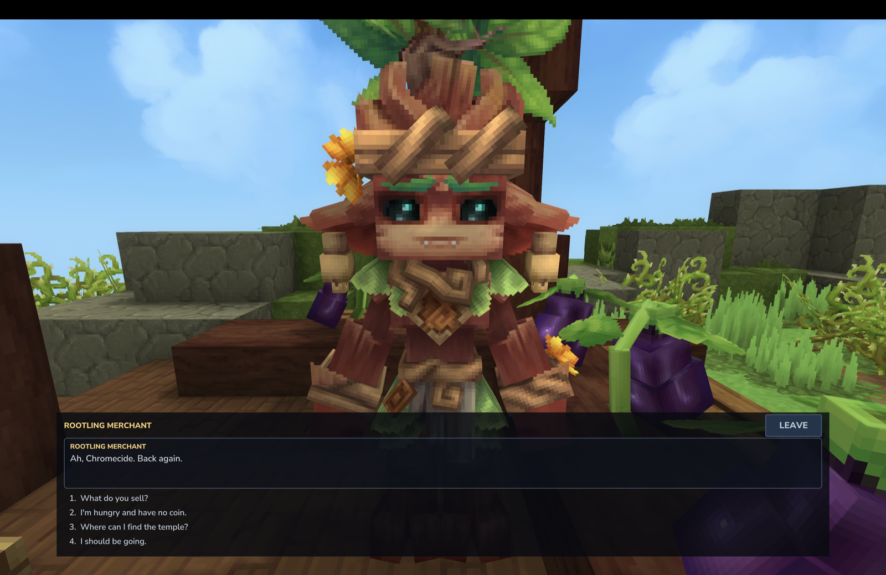

# CurseForge listing draft

**Title:** LowTalk — dialogue for NPCs, props and blocks, made in game or in your editor

**Summary (one line, 232 characters):** Branching dialogue for NPCs, props and blocks: memory, choices and
native Hytale rewards, made in game or in your editor. Open source, MIT. Built with an AI coding agent and
play-tested by hand; the disclosure is in the description.

**Description:**

**Made with AI assistance. Here is exactly what that means, before anything else.**

LowTalk is one person's mod — Chromecide — written in a terminal with an AI coding agent, Claude Code, doing
most of the typing. That belongs at the top of this page rather than the bottom of it.

- **What the person did.** Decided what to build, what to leave out, and when something was not good enough.
  Played every feature in the game by hand. Nothing here is called working because it was written carefully.
- **What the agent did.** Most of the Java, the tests and the documentation, under that direction. Hytale's
  decompiled server sources were read to learn the API, never copied.
- **There is no AI inside the mod.** It makes no network connections of any kind: no telemetry, no analytics,
  no update check, nothing sent to its author or anyone else. Every line a player reads was written by a
  dialogue author, not generated.
- **No AI-generated art, ever.** The tool icon was drawn by [@Trix8ea](https://x.com/Trix8ea); the only other
  images the mod ships are two small frame textures a script draws pixel by pixel from numbers. Contributions
  containing AI-generated images are rejected.
- **How you can check the testing claim.** Every release is walked check by check in the game, on the exact
  jars attached here, on each Hytale version they support, and what was tried is recorded per check and
  stamped with that jar's hash. The harness that drives it and the records it produced are public
  ([LowTalkHarness](https://github.com/chromecide/LowTalkHarness)), and so is the list of what the tests do
  **not** cover ([what the corridor does not reach](https://github.com/chromecide/LowTalk/blob/main/docs/testing.md#what-the-corridor-does-not-reach)).
  It is not decoration: 0.4.0's fix for a condition that could not see what the command above it had just
  done, and for an NPC rename that had never once survived a restart, both came out of that walk rather
  than out of reading the code.

If that is not something you want on your server, that is a fair call and no argument will be made. The
[whole repository](https://github.com/chromecide/LowTalk) is MIT and public, so you can read exactly what you
would be running.

---

LowTalk lets you give any NPC a conversation that remembers the player: greetings that change once you have
met, choices that hand out items or start objectives, secrets that only unlock after another NPC has been spoken
to. A book on a table, a statue, a signpost or a door can talk too. You make it whichever way suits you:

- **In game:** `/lowtalk tool`, use it on an NPC, a prop or a block, and a page shows what it says: bind a
  dialogue, edit it, or create one already bound to it. Edit opens the conversation as an editable version of the
  dialogue window: add lines, options, commands with pickers, conditions and branches without touching a file.
  Use the tool on nothing for a browser of every dialogue on the server.
- **In the Asset Editor:** dialogues are a registered asset type, edited as a form with tooltips and autocomplete
  or as text, validated and loaded on every save.
- **In the Node Editor:** a workspace lets you draw the whole conversation as a graph.
- **As a text file:** a small script-like format for writers who like to type:

```
npc: Kweebec_Merchant

== greeting
<<if $met>>
  Ah, {player}. Back again.
<<else>>
  Well met, traveler.
  <<set $met = true>>
<<endif>>
-> What do you sell?
    <<shop>>
-> I'm hungry and have no coin. <<if not $got_bread>>
    Take this. Don't tell the Elder I'm going soft.
    <<give Food_Bread 1>>
    <<set $got_bread = true>>
-> I should be going.
    <<end>>
```

**What it does**

- Branching dialogue with choices, conditions, and hubs that just work.
- NPCs remember players: per-NPC memory, plus variables that follow a player
  between NPCs, plus world state.
- Native rewards and hooks: give and take items, open the NPC's own barter
  shop, start Hytale objectives and read their state, change the NPC's
  attitude, call an angry one off, play animations and sounds, and run server
  commands (off unless the owner turns it on).
- Spawn an NPC mid-conversation and give it a dialogue of its own, so "fetch
  the guard, then talk to the guard" is one dialogue.
- Text input, so an NPC can ask the player's name or pose a riddle; a box can
  ask for a number and keep asking until it gets one.
- Bind a dialogue to every NPC of a role, or to one specific NPC, from the tool's page.
- Talking props: spawn any block or item as a prop (the game's Entity Spawn page), bind a dialogue with the tool,
  and it gets a "Press F to read" prompt. Move it with the Entity Tool; the dialogue follows.
- Clickable blocks: doors, chests, signs, benches and levers can open a dialogue instead of, or as well as, their
  own action.
- Conversations in a bar at the bottom or top of the screen with the NPC in view, or in a window; full history
  or latest line only; the HUD out of the way while talking. Each mod or pack picks its own defaults.
- A validator that tells you the file and line of every mistake.
- An API so other plugins can add their own functions and commands.
- Everything is server side. Players need nothing installed.

**Not a quest engine.** LowTalk hands out Hytale's own objectives and reads
their state. It leaves journals and trackers to the mods that do those well.

**Open source, MIT.** Fork it, extend it, ship it with your adventure map.

**Commands:** `/lowtalk tool`, `browse`, `reload`, `list`, `open <id>`, `tag <name>`,
`untag <name>`, `tags`, `vars`, `reset`, `stop`, `block bind|unbind|list`, `prop list|unbind`. Authoring commands need
`lowtalk.creator`, server operation needs `lowtalk.admin` (give admins
`lowtalk.*`); players need nothing.

**Requirements:** a Hytale server. **Supported Hytale versions:** release line 0.6.3 to 0.6.8 (`LowTalk-0.4.0.jar`),
pre-release line 0.7.0-pre.2 to 0.7.0-pre.3.1 (`LowTalk-0.4.0+hytale.0.7.0-pre.3.1.jar`); one jar per line is attached to each GitHub
release and the server refuses the wrong one. 0.4.0 was walked end to end on 0.6.8 and on 0.7.0-pre.3.1. No dependencies. LowTalk 0.1.1+ also carries a workaround for the 0.7.0-pre.2
boot failure `Asset 'Rope' of type Beam doesn't exist` (a Hytale asset load-order bug; see the README).

**Credits**

The tool icon, a speech bubble being clicked, was drawn by [@Trix8ea](https://x.com/Trix8ea) on X and is used
with their permission. The mod is MIT; the icon is not, and stays the artist's.

**Version notes for 0.4.0** (the "changelog" box on the file upload)

*One paste. 0.3.1 was built and tested but never uploaded, so everything it changed ships here too — if the
last version you saw was 0.3.0, all of this is new.*

**Read this first: `<<run>>` is off by default now.** If any of your dialogues run a server command, they will
stop doing it until you set `AllowRunCommand: true` in `lowtalk.json`. `<<run>>` executes with the console's
authority and dialogues arrive in asset packs that can come from anybody, so it now waits for an owner to say
yes. The server names every dialogue that uses it at startup. Nothing else in this release needs anything
from you.

**Installing LowTalk puts no words in vanilla NPCs' mouths.** The example dialogues used to be copied in on
first run already bound to Kweebec Merchants, Kweebec Elders and Klops Merchants; a fresh server now has no
bound dialogue until you write or copy one. The examples still ship inside the pack, bound to nothing, so
`/lowtalk browse` and the Asset Editor still have something to start from. Set `CopyExamplesOnFirstRun` to
true in `lowtalk.json` before the first run for the old behaviour.

**The in-game editor explains itself.** Commands are edited as named fields instead of one box of text: a
particle effect asks for a particle, a scale and a number of seconds; giving an item asks for an item and a
count. Items, sounds, entity effects and objectives can be picked from the game's own lists, narrowed by what
you type, and a list too long for a dropdown — the three thousand items on a stock server — gets a search page
of its own. The Add menu offers the common commands by name (give an item, start an objective, open the shop,
play an animation) and says what every kind of row does. Conditions are chosen from a menu rather than
written: "the player has | Food_Bread | yes". Mistakes are marked on the row as you make them rather than when
you press Save. Three pickers that filled the wrong argument are fixed.

**An NPC you spawn mid-conversation can have a dialogue of its own.** `<<spawn Kweebec_Merchant @helper>>`
tags the new NPC, and any dialogue bound to `@helper` is the one it talks with. Before this, a spawned NPC
could only ever have whatever its role already said, so "fetch the guard, then talk to the guard" could not be
written.

**`<<calm>>` makes an NPC forget what it is fighting.** `<<attitude friendly>>` decides who an NPC will start
on, not the fight it is already in — a distinction the docs now make as well. Use the two together to call a
guard off.

**`<<input $n "How many?" number>>` asks again rather than storing a word.** A player who typed letters into a
number box used to find out much later, when the conversation ended in whichever line first did arithmetic on
the answer.

**`<<title>>` takes a style rather than a yes-or-no**, because Hytale 0.7 replaced the flag with an enum and
added `GoblinBreach` and `VoidEviction` to `Default` and `Major`. The styles offered are read off the game's
own enum at startup, so a version that adds one needs no release of this mod. Old `minor`/`major` and the JSON
`Major` boolean still work.

**The tool has an icon of its own**, a speech bubble being clicked, drawn by @Trix8ea. The mod stays MIT; the
icon stays the artist's, and its layered source and checksums are in the repository. There is a Windows
installer for the Node Editor workspace now as well — it mirrors the shell script line for line, but it has
not been run on Windows yet, so please say so if it fails for you.

**Fixed.** A command now runs before the line under it is evaluated, so a condition sees what the command just
did (a `<<learn>>` followed by a check on it used to read the old answer). Renaming an NPC with `<<npc_name>>`
survives a server restart — nothing had marked the entity as needing saving. `<<state>>` says so when a role
has no state by that name instead of failing silently. A dropdown wider than the panel it drew into would not
open at all. Rebuilding the test corridor no longer leaves block bindings behind, and no longer spawns a
second set of station NPCs after a server start.

**For plugin authors.** `DialogueContext` gained `getOpener()` — NPC, block, prop, trigger, join, role,
interaction, command, API — and `getOrigin()`, where a block or prop conversation is happening. Other mods can
name their own commands' arguments with `registerCommandArgs` and get the same named fields and pickers as the
built-in commands.

**How it was tested.** Every check was walked in game, station by station, on the exact jars attached here:
0.6.8 on the release line and 0.7.0-pre.3.1 on the pre-release line. What that walk does not reach is written
down in the repository rather than left unsaid, and the harness that drives it is public.

**Version notes for 0.3.0** (the "changelog" box on the file upload)

One tool, one flow: the LowTalk tool opens a bind page for whatever it is used on (NPC, prop, block, or nothing
for the dialogue browser), each with Bind, Unbind, Edit and New. Talking props with prompts. Clickable blocks. A
browser of every dialogue with Edit and Test. Tool reach matches the game's editor tools. Fixes the editor's "Test
here" opening a dead window. Booted on plain 0.6.5 and 0.7.0-pre.2 servers before release.

**Screenshots** (in `docs/screenshots/`, ready to upload; captions are the suggested CurseForge captions)


*A conversation as players see it. The bar is the default presentation, the options are numbered, and the HUD
steps out of the way while you talk. The merchant knows this player has been here before.*


*Choices with consequences. An option hands over real bread and the game's own narration line says so. The
option that asked for it is not offered again.*


*"What do you sell?" opens the NPC's own barter shop. LowTalk hands off to the game's systems rather than
replacing them, and the conversation picks up where it left off when the shop closes.*


*The in-game editor. Use the LowTalk tool on an NPC, press Edit, and its conversation opens as fields: this
passage greets the player, remembers the meeting and jumps to the hub. Test here plays it from this point.*


*The same dialogues are assets. Hytale's Asset Editor opens a `.talk` file from any pack, and every save is
validated and loaded into the running server.*


*Or draw it. Hytale's Node Editor with the LowTalk workspace: passages, options, branches and commands wired
together.*

Worth capturing later, not needed for the listing: the bind pages for an NPC, a prop and a block; a talking prop
with its "Press F to read" prompt; the dialogue browser; the window and top layouts beside the bar; and
`/lowtalk reload` printing a line-numbered error.
