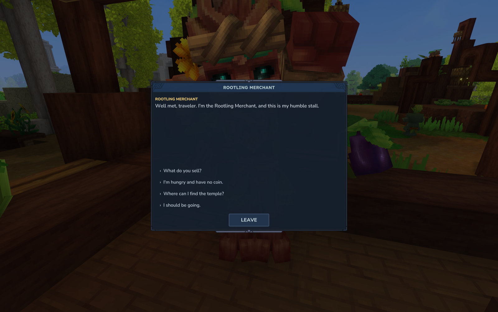
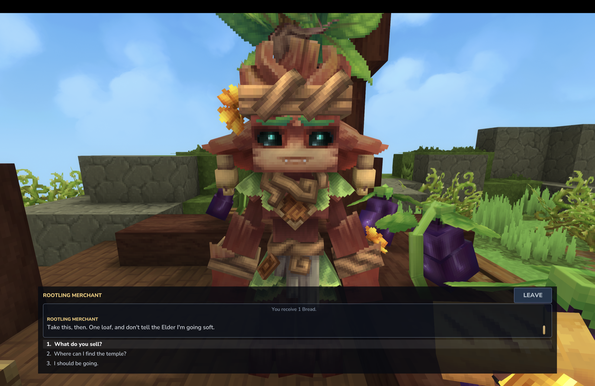
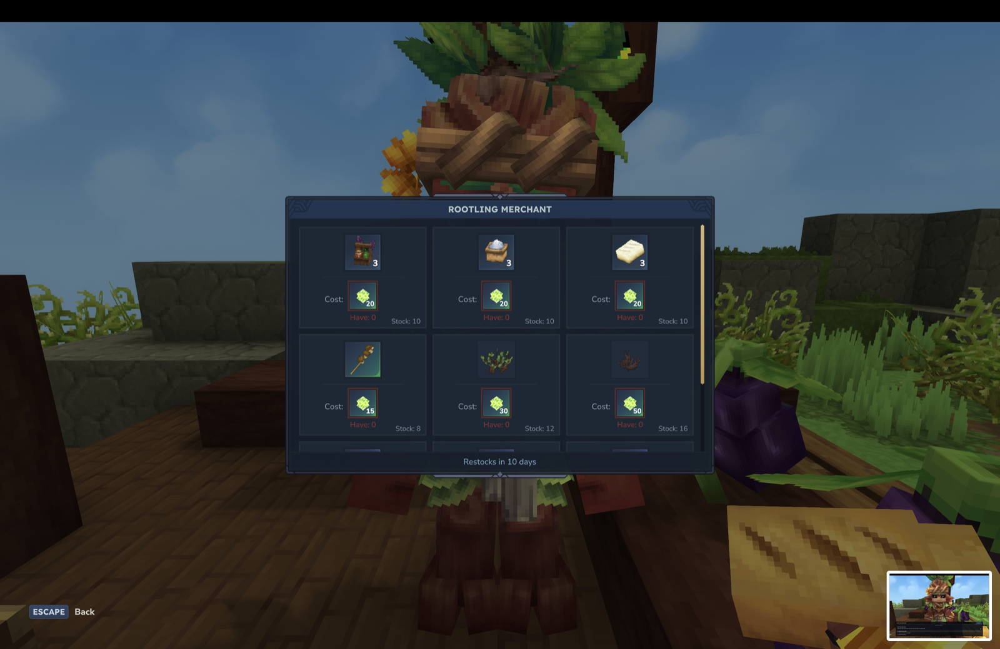
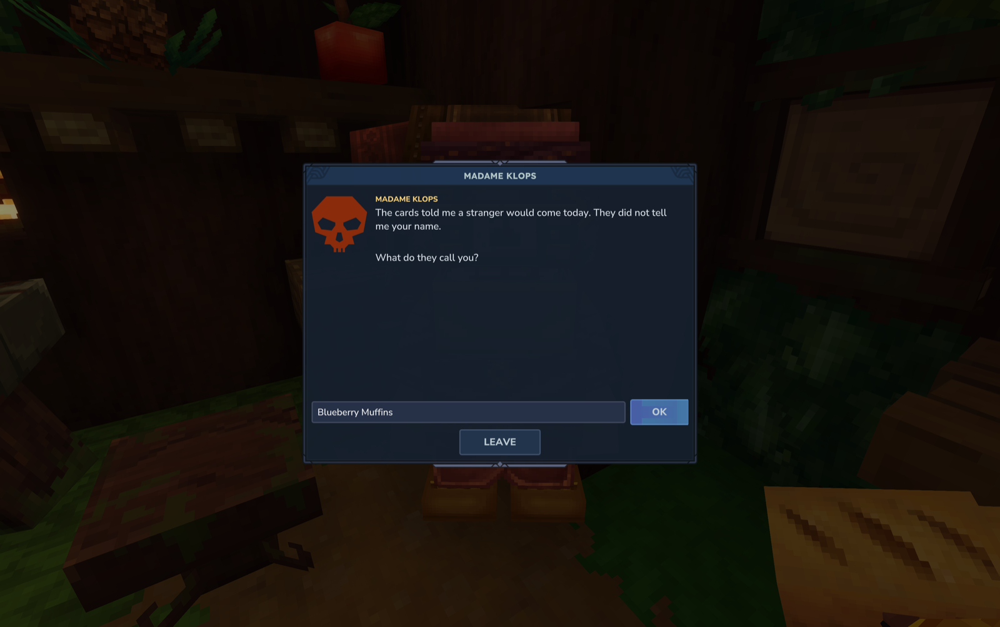
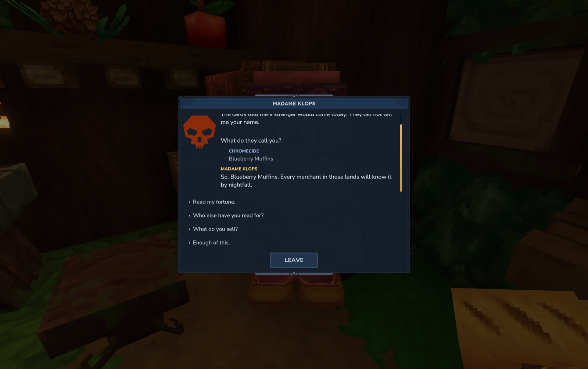
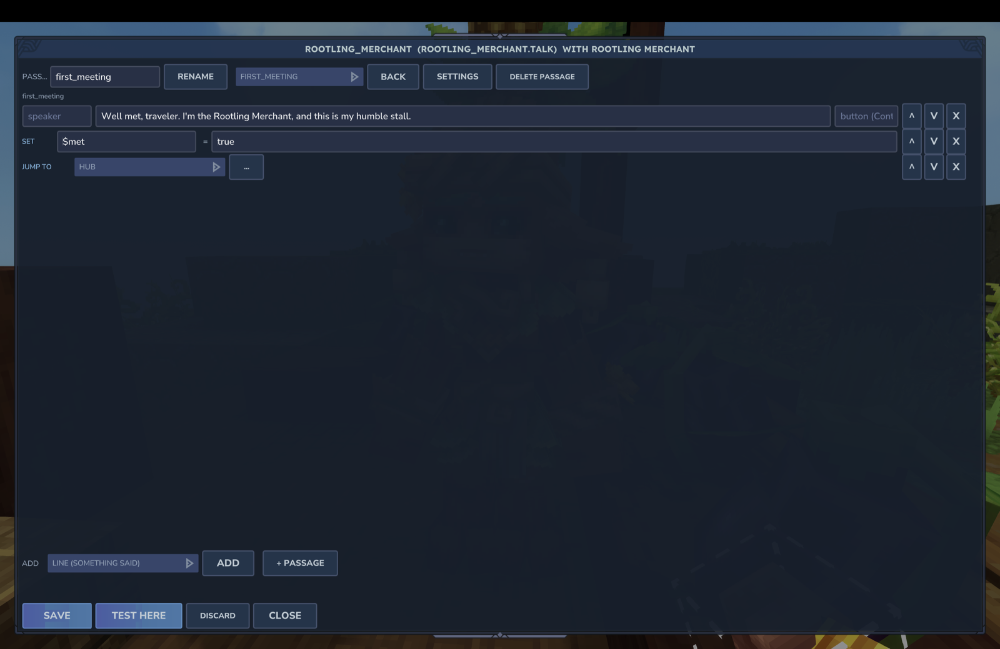
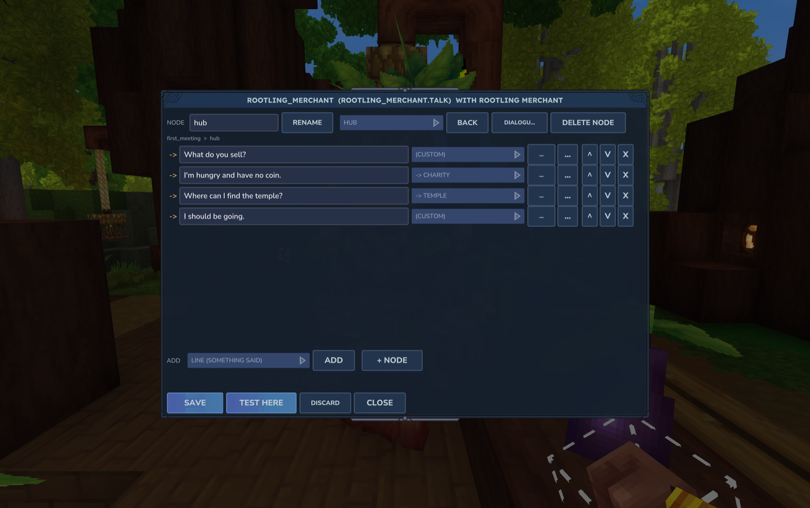
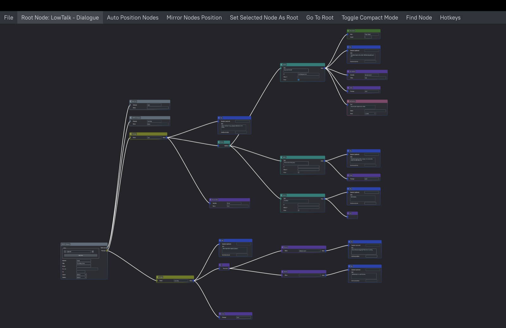
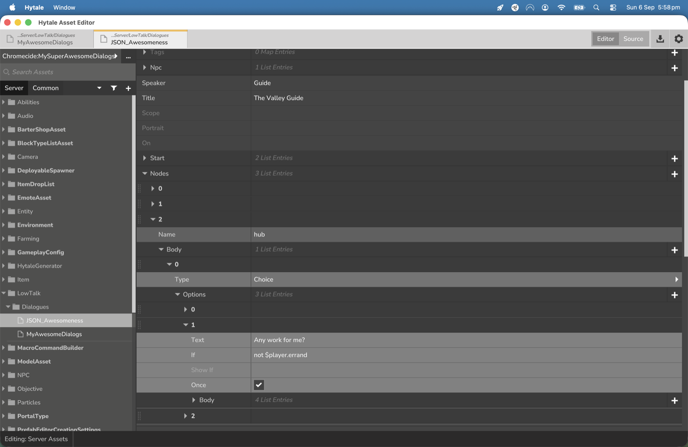
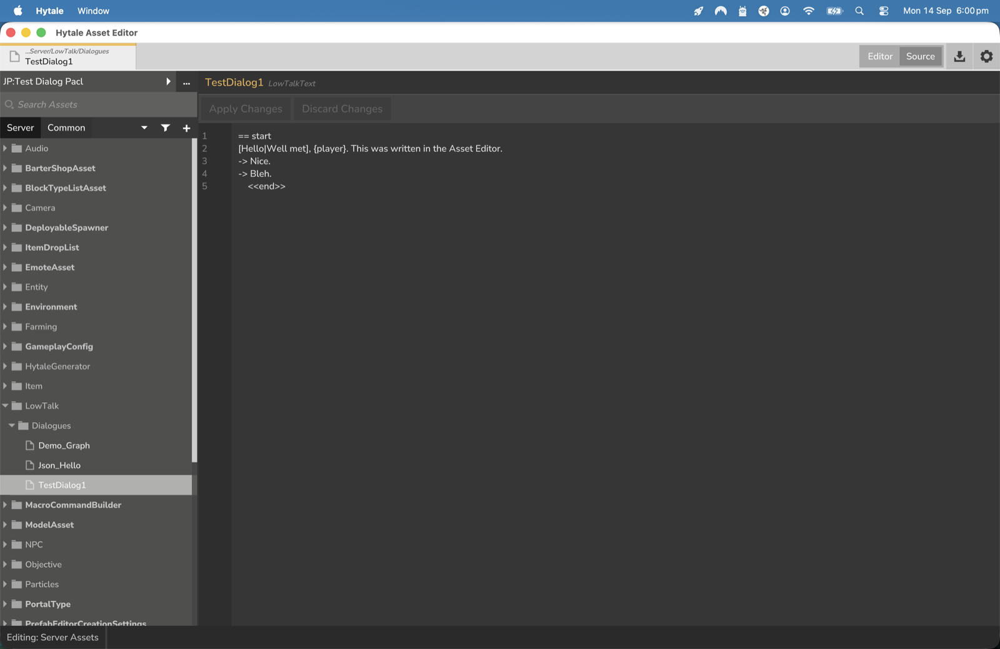

# CurseForge listing draft

**Title:** LowTalk — NPC dialogue, made in game or in your editor

**Summary (one line):** Give any NPC a real conversation: branching dialogue with memory, choices and native
Hytale rewards. Build it in game with a tool, in the Asset Editor, in the Node Editor, or as a text file. Open
source.

**Description:**

LowTalk lets you give any NPC a conversation that remembers the player: greetings that change once you have
met, choices that hand out items or start objectives, secrets that only unlock after another NPC has been spoken
to. You make it whichever way suits you:

- **In game:** `/lowtalk tool`, click an NPC, and its conversation opens as an editable version of the dialogue
  window. Add lines, options, commands with pickers, conditions and branches without touching a file.
- **In the Asset Editor:** dialogues are a registered asset type, edited as a form with tooltips and autocomplete
  or as text, validated and loaded on every save.
- **In the Node Editor:** a workspace lets you draw the whole conversation as a graph.
- **As a text file:** a small script-like format for writers who like to type:

```
npc: Kweebec_Merchant

== greeting
<<if $met>>
  Ah, {player}. Back again.
<<else>>
  Well met, traveler.
  <<set $met = true>>
<<endif>>
-> What do you sell?
    <<shop>>
-> I'm hungry and have no coin. <<if not $got_bread>>
    Take this. Don't tell the Elder I'm going soft.
    <<give Food_Bread 1>>
    <<set $got_bread = true>>
-> I should be going.
    <<end>>
```

**What it does**

- Branching dialogue with choices, conditions, and hubs that just work.
- NPCs remember players: per-NPC memory, plus variables that follow a player
  between NPCs, plus world state.
- Native rewards and hooks: give and take items, open the NPC's own barter
  shop, start Hytale objectives and read their state, change the NPC's
  attitude, play animations and sounds, run commands.
- Text input, so an NPC can ask the player's name or pose a riddle.
- Bind a dialogue to every NPC of a role, or tag one specific NPC in game.
- A validator that tells you the file and line of every mistake.
- An API so other plugins can add their own functions and commands.
- Everything is server side. Players need nothing installed.

**Not a quest engine.** LowTalk hands out Hytale's own objectives and reads
their state. It leaves journals and trackers to the mods that do those well.

**Open source, MIT.** Fork it, extend it, ship it with your adventure map.

**Commands:** `/lowtalk reload`, `list`, `open <id>`, `tag <name>`,
`untag <name>`, `tags`, `vars`, `reset`, `stop`. Authoring commands need
`lowtalk.creator`, server operation needs `lowtalk.admin` (give admins
`lowtalk.*`); players need nothing.

**Requirements:** a Hytale server. **Supported Hytale versions:** release line 0.6.3 to 0.6.5 (`LowTalk-0.1.1.jar`),
pre-release line 0.7.0-pre.2 (`LowTalk-0.1.1+hytale.0.7.0-pre.2.jar`); one jar per line is attached to each GitHub
release and the server refuses the wrong one. No dependencies. LowTalk 0.1.1+ also carries a workaround for the 0.7.0-pre.2
boot failure `Asset 'Rope' of type Beam doesn't exist` (a Hytale asset load-order bug; see the README).

**AI Use Disclosure**

LowTalk was designed, directed and play-tested by one person; most of the code
and documentation was written by Claude Code under that direction. There is no AI inside the mod: every line a
player reads is written by a dialogue author, and the plugin makes no network calls. The repository is public so
you can see exactly what you are running.

**Screenshots** (in `docs/screenshots/`, ready to upload; captions are the suggested CurseForge captions)


*Talking to an NPC. The window is the game's own UI style; options appear as the conversation branches.*


*Memory and consequences: the merchant greets a returning player by name, and a choice hands over real bread with the game's own narration line.*


*"What do you sell?" opens the NPC's own barter shop. LowTalk hands off to the game's systems rather than replacing them.*


*Text input: an NPC can ask a question and keep the answer. Portraits are any image from an asset pack.*


*The answer becomes a variable that follows the player between NPCs: "So. Blueberry Muffins. Every merchant in these lands will know it by nightfall."*


*The in-game editor: click an NPC with the LowTalk tool and its conversation opens as fields. This passage greets the player, remembers the meeting and jumps to the hub.*


*Options in the in-game editor. Each has a target: another passage, the end, back to the options, or a new passage; Go walks into it.*


*The same kind of dialogue drawn in Hytale's Node Editor with the LowTalk workspace: passages, options, branches and commands wired up.*


*The Asset Editor's form: a dialogue as fields. This option is shown only until the errand is taken, once, and its body hands over bread.*


*Text mode in the Asset Editor. Every save is validated and loaded; the notification says what was loaded and which NPCs it binds to.*

Still to capture: `/lowtalk reload` output showing a line-numbered error.
